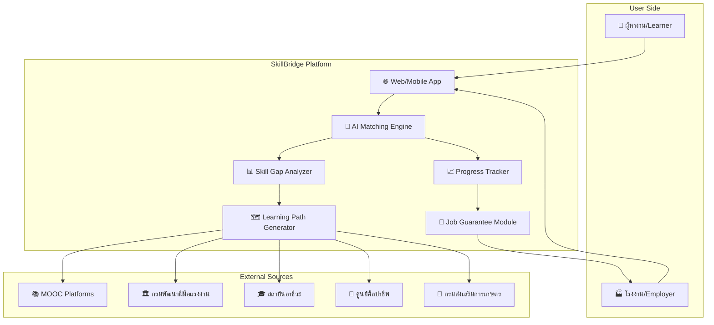
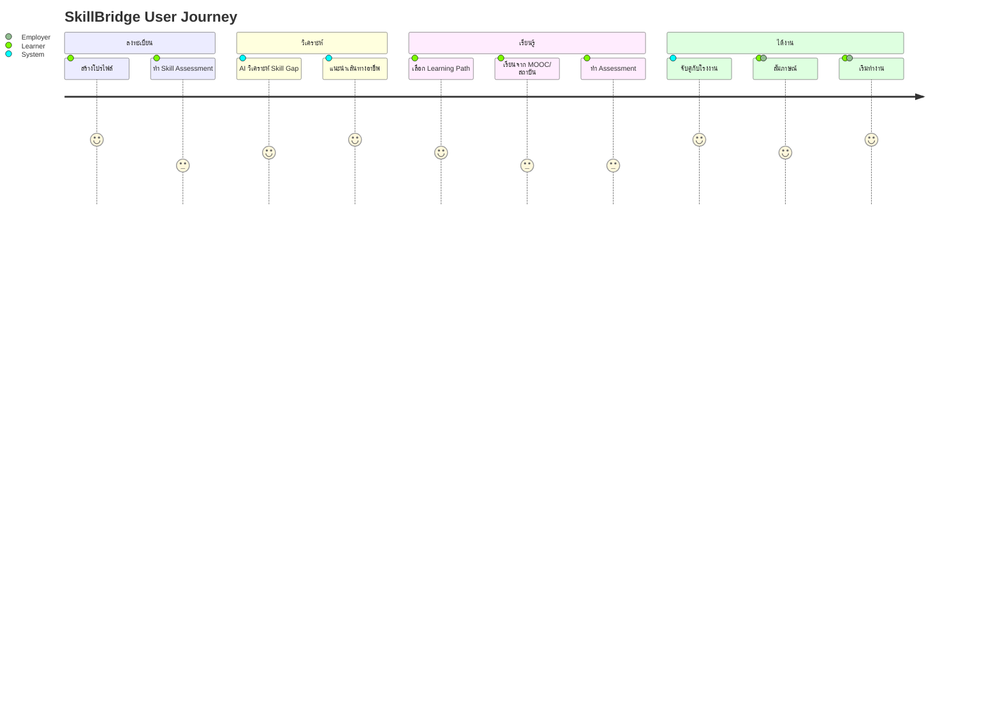

# 🏆 โครงการ "SkillBridge" – สะพานทักษะ เชื่อมคนสู่งาน

> แพลตฟอร์มเชื่อมโยงภาคอุตสาหกรรมกับผู้แสวงหาโอกาส ผ่านระบบแนะนำเส้นทางการเรียนรู้อัจฉริยะ

---

## 1. วิเคราะห์แนวคิดโครงการ (Project Concept Analysis)

### 1.1 สาระสำคัญ (Core Value Proposition)

| มิติ | รายละเอียด |
|------|-----------|
| **Pain Point** | โรงงาน/สถานประกอบการขาดแรงงานที่มีทักษะตรงความต้องการ; คนทั่วไปไม่รู้ต้องเรียนอะไร / เข้าถึงแหล่งเรียนฟรียาก |
| **Solution** | แพลตฟอร์ม 2-sided marketplace ที่จับคู่ "ความต้องการของงาน" กับ "เส้นทางการเรียนรู้" แบบอัตโนมัติ |
| **Unique Value** | การันตีงานเมื่อผ่านเส้นทางการเรียนรู้ (Guaranteed Job Placement) + เน้นแหล่งเรียนฟรี/ต้นทุนต่ำ |
| **Target Users** | (1) ผู้หางาน / ผู้ต้องการ upskill-reskill (2) โรงงาน / สถานประกอบการ |

### 1.2 ความสอดคล้องกับ 3 ธีมหลัก

#### ธีม 1: Society & Environment – ชุมชน สิ่งแวดล้อม คุณภาพชีวิต ✅
- ลดความเหลื่อมล้ำทางการศึกษา – เปิดโอกาสเข้าถึงการเรียนรู้ฟรี
- ยกระดับคุณภาพชีวิตชุมชน – คนมีงานทำ มีรายได้มั่นคง
- แก้ปัญหาการว่างงานเชิงโครงสร้าง (Structural Unemployment)

#### ธีม 2: Creativity – วัฒนธรรม ภูมิปัญญา เศรษฐกิจสร้างสรรค์ ✅
- อนุรักษ์ภูมิปัญญาท้องถิ่นผ่านหลักสูตรงานฝีมือ/งานศิลป์ (เชื่อมกับศูนย์ศิลปาชีพ)
- สร้างเศรษฐกิจสร้างสรรค์จากฐานทักษะชุมชน
- รวบรวมหลักสูตรด้านวัฒนธรรมจากสถาบันต่างๆ

#### ธีม 3: Urban Living – สังคมเมือง การพัฒนายั่งยืน ✅
- รองรับ Urban Migration – คนย้ายเข้าเมืองมีเส้นทางอาชีพชัดเจน
- ส่งเสริม Lifelong Learning ในสังคมเมือง
- สร้างระบบนิเวศแรงงานที่ยั่งยืน (Sustainable Workforce Ecosystem)

### 1.3 ความเชื่อมโยงกับพระราชกรณียกิจ

| พระราชกรณียกิจ | ความเชื่อมโยง |
|----------------|--------------|
| **ศูนย์ศิลปาชีพ** | ⭐ เชื่อมโยงโดยตรง – การสร้างอาชีพจากทักษะ, รวมหลักสูตรงานศิลปาชีพเข้าสู่ระบบ |
| **โครงการฟาร์มตัวอย่าง** | การฝึกอาชีพเกษตรกรรม, เชื่อมหลักสูตรเกษตรจากกรมพัฒนาฝีมือแรงงาน |
| **สถาบันสิริกิติ์** | การอนุรักษ์ผ้าไทย → หลักสูตรทอผ้า/ออกแบบสิ่งทอ |
| **สภากาชาดไทย** | หลักสูตรด้านสาธารณสุข, การพยาบาล, อาสาสมัคร |
| **โครงการป่ารักน้ำ / บ้านเล็กในป่าใหญ่** | หลักสูตรด้านสิ่งแวดล้อม, ป่าไม้, เกษตรยั่งยืน |

> **พระราชปณิธาน "พัฒนาคน ควบคู่การอนุรักษ์"** → SkillBridge พัฒนาคนด้วยการเรียนรู้ตลอดชีวิต ควบคู่กับการอนุรักษ์ภูมิปัญญาและทักษะดั้งเดิม

---

## 2. ออกแบบระบบ (System Architecture Design)

### 2.1 ภาพรวมสถาปัตยกรรม

### 2.2 Core Modules

| Module | หน้าที่ | เทคโนโลยี |
|--------|--------|-----------|
| **AI Matching Engine** | จับคู่ทักษะผู้ใช้กับความต้องการของงาน | NLP, Recommendation System |
| **Skill Gap Analyzer** | วิเคราะห์ช่องว่างทักษะเทียบกับ Job Requirements | ML Classification, Skill Taxonomy |
| **Learning Path Generator** | สร้างเส้นทางเรียนรู้จาก Gap Analysis | Algorithm Optimization, Course Aggregation |
| **Progress & Assessment** | ติดตามความก้าวหน้า + ประเมินผล | Data Analytics, Gamification |
| **Job Guarantee System** | ระบบรับรองและจับคู่งาน | Contract Management, Matching |

### 2.3 User Journey Flow

---

## 3. วิเคราะห์ตามเกณฑ์ตัดสิน (Judging Criteria Alignment)

### 3.1 เทคโนโลยีและนวัตกรรม (30%) 🔑

| จุดเด่น | คะแนนคาดการณ์ |
|---------|--------------|
| AI-powered Skill Gap Analysis | ★★★★★ |
| Adaptive Learning Path ปรับตามผู้เรียน | ★★★★☆ |
| Multi-source Course Aggregation | ★★★★☆ |
| Data-driven Job Matching | ★★★★★ |

**กลยุทธ์เสริมจุดแข็ง:**
- เน้น AI/ML เป็นหัวใจหลัก – แสดง Demo ของ Skill Gap Analysis
- ใช้ NLP วิเคราะห์ Job Description → สกัด Required Skills อัตโนมัติ
- สร้าง Skill Taxonomy Graph เชื่อมโยงทักษะ-อาชีพ-หลักสูตร

### 3.2 ศักยภาพเชิงธุรกิจและตลาด (30%) 🔑

**Revenue Model:**

| แหล่งรายได้ | รายละเอียด |
|------------|-----------|
| **B2B Subscription** | โรงงาน/บริษัทจ่ายค่าสมาชิกเพื่อเข้าถึง Talent Pool |
| **Placement Fee** | ค่าธรรมเนียมเมื่อจับคู่งานสำเร็จ (% ของเงินเดือน) |
| **Premium Features** | ผู้เรียนจ่ายเพิ่มสำหรับ Mentorship, Fast-track |
| **Government Subsidy** | ร่วมมือกับภาครัฐ (กรมพัฒนาฝีมือแรงงาน) |

**ขนาดตลาด:**
- แรงงานไทย ~39 ล้านคน, อัตราว่างงาน ~1% แต่ Skill Mismatch สูง
- ตลาด EdTech ไทย เติบโตเฉลี่ย 15-20% ต่อปี
- โรงงานอุตสาหกรรม ~70,000+ แห่งในไทย

### 3.3 กลยุทธ์การดำเนินงาน (25%)

**Roadmap:**

| Phase | ระยะเวลา | เป้าหมาย |
|-------|----------|---------|
| **Phase 1: MVP** | เดือน 1-3 | Prototype: Skill Assessment + Course Aggregation |
| **Phase 2: Pilot** | เดือน 4-6 | ทดลองกับ 5 โรงงาน + 100 ผู้เรียน |
| **Phase 3: Scale** | เดือน 7-12 | ขยาย 50 โรงงาน + 1,000 ผู้เรียน |
| **Phase 4: Growth** | ปีที่ 2 | เปิดทั่วประเทศ + เพิ่ม Industry Vertical |

**Risk Management:**

| ความเสี่ยง | การจัดการ |
|-----------|----------|
| โรงงานไม่เข้าร่วม | เริ่มจาก Partnership กับสภาอุตสาหกรรม |
| ผู้เรียน Drop-out | Gamification + Mentorship + เงื่อนไขการันตีงาน |
| คุณภาพหลักสูตรไม่สม่ำเสมอ | ระบบ Rating + Review + QA Committee |
| ข้อมูลส่วนบุคคล | PDPA Compliance + Data Encryption |

### 3.4 การนำเสนอ (15%)

→ ดูรายละเอียดในส่วน Presentation Structure ด้านล่าง

---

## 4. โครงสร้าง Presentation (15 Slides)

| Slide | ชื่อ | เนื้อหาหลัก | เวลา |
|-------|-----|-------------|------|
| 1 | **Cover** | ชื่อโครงการ "SkillBridge" + Tagline + ชื่อทีม | 15s |
| 2 | **แรงบันดาลใจ** | เชื่อมโยงพระราชกรณียกิจ ศูนย์ศิลปาชีพ + พระราชปณิธาน "พัฒนาคน ควบคู่อนุรักษ์" | 45s |
| 3 | **ปัญหา (Problem)** | Skill Mismatch + สถิติ + Pain Points ทั้ง 2 ฝั่ง | 45s |
| 4 | **ขนาดปัญหา (Market Size)** | ตัวเลขตลาดแรงงาน + EdTech + โรงงาน | 30s |
| 5 | **Solution Overview** | SkillBridge คืออะไร – ภาพรวมแพลตฟอร์ม | 45s |
| 6 | **How It Works** | User Journey Flow 4 ขั้นตอน | 60s |
| 7 | **เทคโนโลยี (AI/ML)** | Skill Gap Analysis + Matching Engine + Adaptive Path | 60s |
| 8 | **Demo/Prototype** | Mockup หรือ Live Demo ของระบบ | 60s |
| 9 | **ธีมเชื่อมโยง** | ความสอดคล้องกับ 3 ธีม + Track Education Tech | 30s |
| 10 | **Business Model** | Revenue Streams + Value Proposition Canvas | 45s |
| 11 | **Market Strategy** | Go-to-Market + Partnership Strategy | 30s |
| 12 | **Roadmap** | 4 Phases + Milestones | 30s |
| 13 | **ทีมงาน** | สมาชิก + ความเชี่ยวชาญ | 15s |
| 14 | **Social Impact** | ผลกระทบเชิงสังคม + เป้าหมาย SDGs | 30s |
| 15 | **Call to Action** | สรุป + ขอบคุณ + Q&A | 15s |

---

## 5. แผนการแบ่งงาน (Work Breakdown)

### 5.1 บทบาทที่ต้องการ

| บทบาท | ความรับผิดชอบ | ลำดับความสำคัญ |
|-------|-------------|--------------|
| **🎯 Project Lead** | ดูแลภาพรวม, ประสานงานทีม, นำเสนอ | สูงสุด |
| **🎨 UX/UI Designer** | ออกแบบ Mockup, Prototype, Presentation Deck | สูงสุด |
| **💻 Tech Lead** | ออกแบบ System Architecture, พัฒนา Prototype | สูง |
| **📊 Business Analyst** | วิเคราะห์ตลาด, Business Model, Financial Projection | สูง |
| **📝 Content/Research** | ค้นคว้าข้อมูล, เขียน Content, เชื่อมโยงพระราชกรณียกิจ | กลาง |

### 5.2 ลำดับงานตาม Priority

> [!IMPORTANT]
> **งานวิกฤต (Critical Path)** – ต้องทำให้เสร็จก่อน

**🔴 Priority 1: ทำทันที (วันที่ 1-2)**
1. ✍️ กำหนดชื่อโครงการ + Tagline สุดท้าย
2. 📝 เขียน Problem Statement + Solution Statement ให้ชัดเจน
3. 🎨 เริ่มออกแบบ Presentation Deck Template
4. 📊 รวบรวมสถิติตลาดแรงงาน + EdTech

**🟡 Priority 2: ทำต่อเนื่อง (วันที่ 2-4)**
5. 💻 สร้าง Mockup/Wireframe ของแพลตฟอร์ม
6. 🤖 ออกแบบ AI Matching Engine Diagram
7. 💰 จัดทำ Business Model Canvas
8. 📖 ค้นคว้าพระราชกรณียกิจ + เขียนเชื่อมโยง

**🟢 Priority 3: ขัดเกลา (วันที่ 4-5)**
9. 🎬 ทำ Demo/Video ของ Prototype
10. 📊 ทำ Financial Projection + Impact Metrics
11. 🎤 ซ้อมนำเสนอ + จับเวลา
12. ✅ Review รอบสุดท้าย + ปรับแก้

---

## 6. จุดแข็ง & จุดที่ต้องเสริม

### ✅ จุดแข็งของไอเดีย
- **Guaranteed Job Placement** – Value Proposition ชัดเจน แตกต่างจากแพลตฟอร์มอื่น
- **Two-sided Marketplace** – สร้าง Network Effect ได้
- **เน้นการเรียนฟรี/ต้นทุนต่ำ** – สอดคล้องกับ Social Impact
- **เชื่อมโยงพระราชกรณียกิจ** – ตรงธีม, มีเรื่องเล่าที่ทรงพลัง
- **AI-driven** – ตอบโจทย์เกณฑ์เทคโนโลยี/นวัตกรรม

### ⚠️ จุดที่ต้องเสริมให้แน่น

> [!WARNING]
> ต้องตอบคำถามเหล่านี้ให้ได้ในการนำเสนอ

1. **"การันตีงาน" ทำอย่างไร?** → ต้องมีกลไกชัด เช่น MOU กับโรงงาน, เงื่อนไขผ่านการประเมิน
2. **แตกต่างจาก JobThai, LinkedIn Learning อย่างไร?** → เน้นว่า "end-to-end" จาก Assessment → Learning → Job
3. **หลักสูตรฟรีมีคุณภาพพอหรือไม่?** → QA System + Partnership กับสถาบันที่ได้รับรอง
4. **ข้อมูลจากโรงงานเพียงพอหรือไม่?** → เริ่มจาก Pilot กับ Industry Partners

---

## 7. Verification Plan

เนื่องจากนี่เป็นงานวางแผน/ออกแบบไม่ใช่เขียนโค้ด การ Verify จะเป็น:

### Manual Review
- ตรวจสอบความครบถ้วนตามเกณฑ์ตัดสิน 4 ข้อ
- ตรวจสอบความสอดคล้องกับ 3 ธีมหลัก
- ตรวจสอบความเชื่อมโยงกับพระราชกรณียกิจ
- ทบทวน Flow ของ Presentation ว่าเล่าเรื่องได้ลื่น

### User Review
- ขอให้ทีมทบทวนแผนทั้งหมดก่อนเริ่มทำ Presentation จริง
